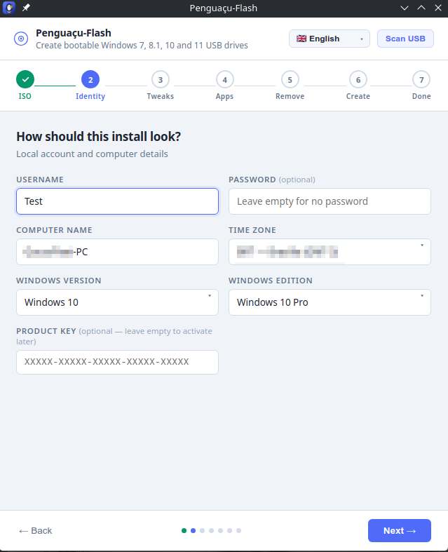
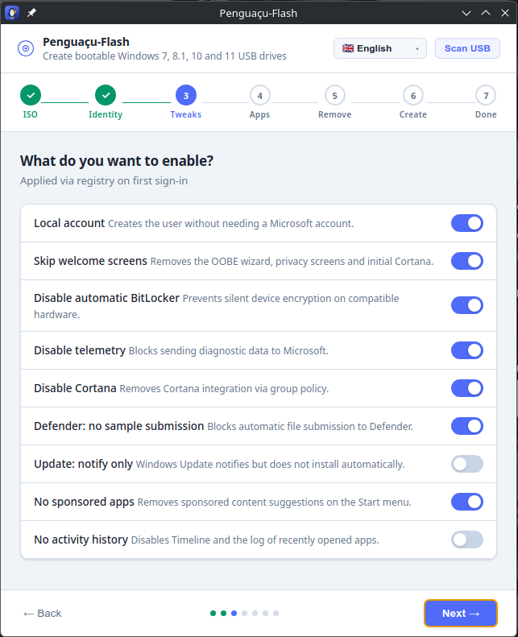
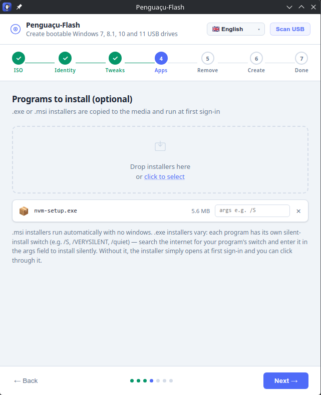
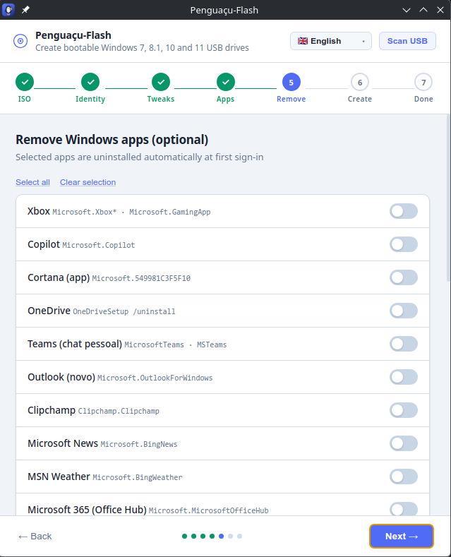
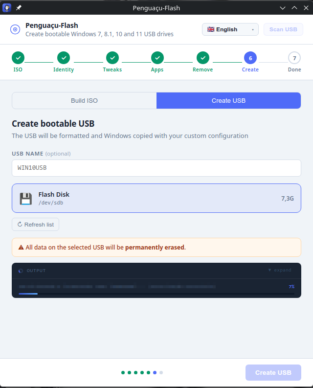
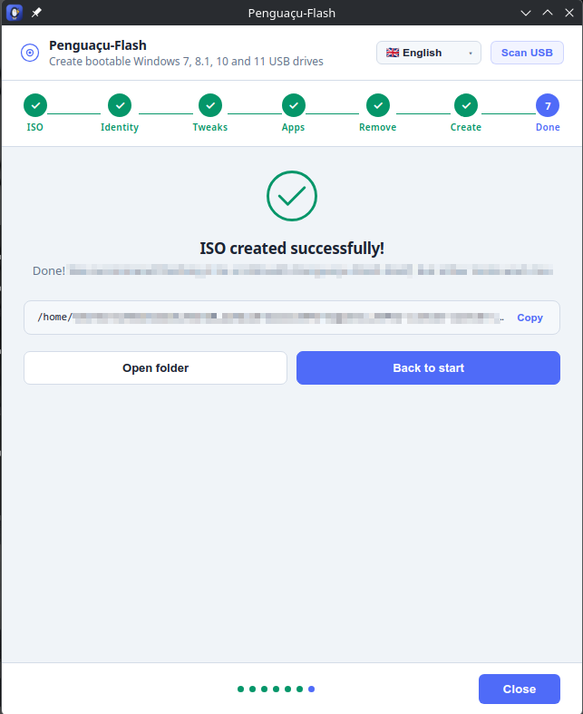

<div align="center">


# Penguaçu-Flash

### Crie pendrives bootáveis do Windows 7 · 8.1 · 10 · 11, a partir do Linux — do jeito fácil

Um AppImage totalmente autocontido que formata seu pendrive, copia o Windows e injeta um `autounattend.xml` personalizado — para que a instalação rode sem intervenção, já com sua conta, idioma e ajustes de privacidade definidos.

**🌍 Leia em:** [English](README.md) · **Português** · [Español](README.es.md) · [中文](README.zh.md) · [हिन्दी](README.hi.md) · [العربية](README.ar.md)

<br/>


</div>

---

## ✨ Por que o Penguaçu-Flash?

Fazer um pendrive de instalação do Windows no Linux geralmente significa lidar com `parted`, `mkntfs`, `7z` e ferramentas de setor de boot na mão — e ainda assim o Windows para no meio da instalação fazendo perguntas. O Penguaçu-Flash faz tudo em uma única janela:

- 🐧 **Roda em qualquer lugar** — um AppImage autocontido. Sem dependências para instalar: `7-Zip`, `mkntfs` e `ms-sys` já vêm embutidos.
- 💾 **Pendrive bootável de verdade** — particiona, formata NTFS, copia o Windows e grava os setores de boot para **UEFI e BIOS/legado**.
- 🪄 **Realmente sem intervenção** — injeta um `autounattend.xml` personalizado para o setup passar direto pelas perguntas, com usuário, senha, nome da máquina, fuso e edição já preenchidos.
- 🧭 **Windows 7 → 11, detectado automaticamente** — a versão é reconhecida pelo nome do arquivo ISO, e o arquivo de resposta se adapta ao schema de cada versão.
- 🛡️ **Windows 11 sem os bloqueios** — bypass opcional dos requisitos de TPM 2.0, Secure Boot, RAM e CPU.
- 🔒 **Privacidade de fábrica** — desligue telemetria, Cortana, BitLocker automático, apps patrocinados e mais.
- 📊 **Progresso honesto** — a barra acompanha os bytes *fisicamente gravados no dispositivo* (com MB/s ao vivo), não o número enganoso do cache de RAM.
- 🌐 **Fala 6 idiomas** — português, inglês, espanhol, chinês, hindi e árabe (com layout da direita para a esquerda completo).

---

## 📸 Capturas de tela

<div align="center">

| Selecione a ISO | Identidade & edição |
|:--:|:--:|
|  |  |
| **Ajustes de privacidade** | **Programas pré-instalados** |
|  |  |
| **Remover apps do Windows** | **Crie o pendrive bootável** |
|  |  |

**Pronto!**



</div>

---

## 🚀 Baixar e executar

1. Baixe o **`Penguaçu-Flash-*.AppImage`** mais recente na página de [**Releases**](../../releases).
2. Torne-o executável e rode:

```bash
chmod +x Penguaçu-Flash-*.AppImage
./Penguaçu-Flash-*.AppImage
```

É só isso — sem instalação, sem dependências. As etapas privilegiadas (particionar, formatar, gravar setores de boot) pedem sua senha uma vez, pelo diálogo de autorização padrão do sistema.

> **Dica:** no KDE/GNOME você também pode simplesmente dar dois cliques no AppImage pelo gerenciador de arquivos.

---

## 🧭 Como usar

| Passo | O que acontece |
|-------|----------------|
| **1. ISO** | Solte sua ISO do Windows. A versão (7/8.1/10/11) é detectada automaticamente. |
| **2. Identidade** | Defina usuário, senha, nome da máquina, fuso, edição e (opcional) chave de produto. |
| **3. Ajustes** | Escolha os ajustes de privacidade/comportamento e, para o Windows 11, o bypass de requisitos. |
| **4. Criar** | Escolha **Gerar ISO** (um novo `.iso` personalizado) ou **Criar Pendrive** (formata + copia + injeta um pendrive pronto para bootar). |
| **5. Pronto** | Inicie a máquina de destino pelo pendrive — o Windows se instala com as suas configurações. |

Você também pode **analisar um pendrive existente**, ler o `autounattend.xml` dele e reinjetar uma configuração atualizada sem recriar nada.

---

## 🛠️ Compilar do código-fonte

Requisitos: **Node.js 18+**, e na máquina de build o `ntfsprogs` (para o `mkntfs`) mais `gcc`/`make` (para compilar o `ms-sys` embutido).

```bash
git clone https://github.com/vitormoreiradesenvolvedor/penguacu-flash.git
cd penguacu-flash
npm install

# Baixa/compila os binários embutidos (7-Zip, mkntfs, ms-sys) em ./bin
npm run prepare-bins

# Gera dist/Penguaçu-Flash-<versão>.AppImage
npm run dist
```

Para rodar durante o desenvolvimento:

```bash
npm start
```

### Estrutura do projeto

```
├── main.js              # Processo principal do Electron — lógica de USB/ISO, IPC
├── preload.js           # API exposta ao renderer via contextBridge
├── index.html           # Toda a interface (assistente, dicionário i18n, estilos)
├── scripts/
│   ├── prepare-bins.sh  # Baixa/compila os binários embutidos
│   └── afterPack.js     # Envolve o binário do Electron (ambiente + filtro de ruído)
└── build/
    ├── icon.svg         # Ícone-fonte
    └── icons/           # Tamanhos PNG renderizados
```

---

## 🤝 Contribuindo

Contribuições são muito bem-vindas — este projeto existe para ajudar a comunidade Linux, e melhora com mais mãos. 🐧

- 🌐 **Traduções**: o dicionário da interface fica no `index.html` (objeto `I18N`). Adicionar ou melhorar um idioma é um ótimo primeiro PR.
- 🐛 **Bugs e ideias**: abra uma [issue](../../issues) com passos claros para reproduzir.
- 🔧 **Código**: faça fork, crie um branch a partir de **`development`** e abra um pull request contra ele.

Veja o [CONTRIBUTING.md](CONTRIBUTING.md) para o guia completo. Modelo de branches:

- **`master`** — código estável, lançado.
- **`development`** — onde o trabalho novo entra antes do próximo lançamento.

---

## ⚠️ Aviso

Criar um pendrive bootável **apaga todos os dados** do disco selecionado. Confira duas vezes se escolheu o dispositivo certo. As chaves de produto exibidas no app são as chaves genéricas/KMS públicas da Microsoft — elas selecionam a edição durante o setup, mas **não ativam** o Windows. Ative com uma licença válida.

---

## 📄 Licença

Distribuído sob a [Licença MIT](LICENSE) — livre para usar, modificar e compartilhar.

<div align="center">
<br/>
Feito com 🐧 para a comunidade Linux.
</div>
