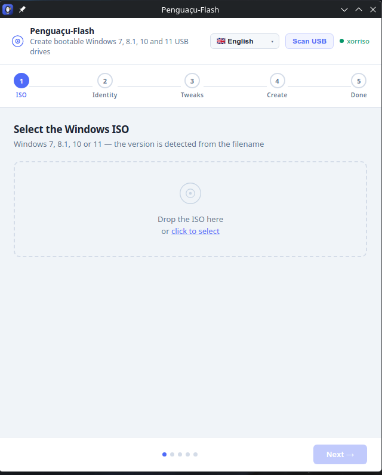
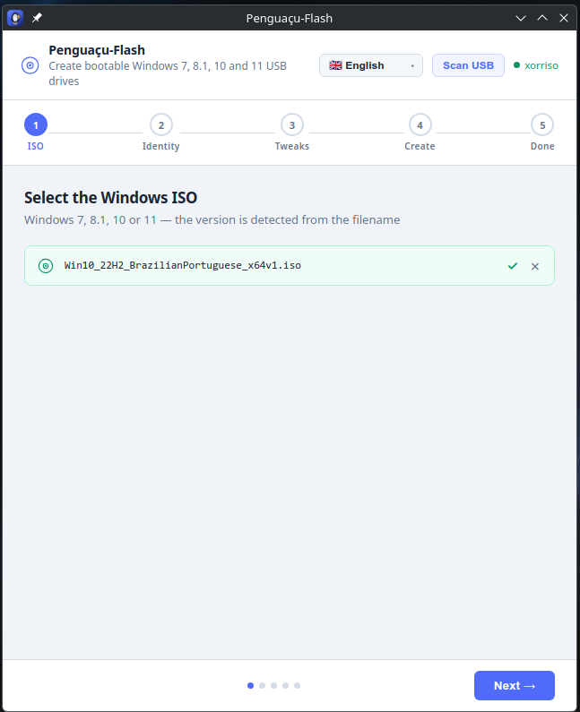
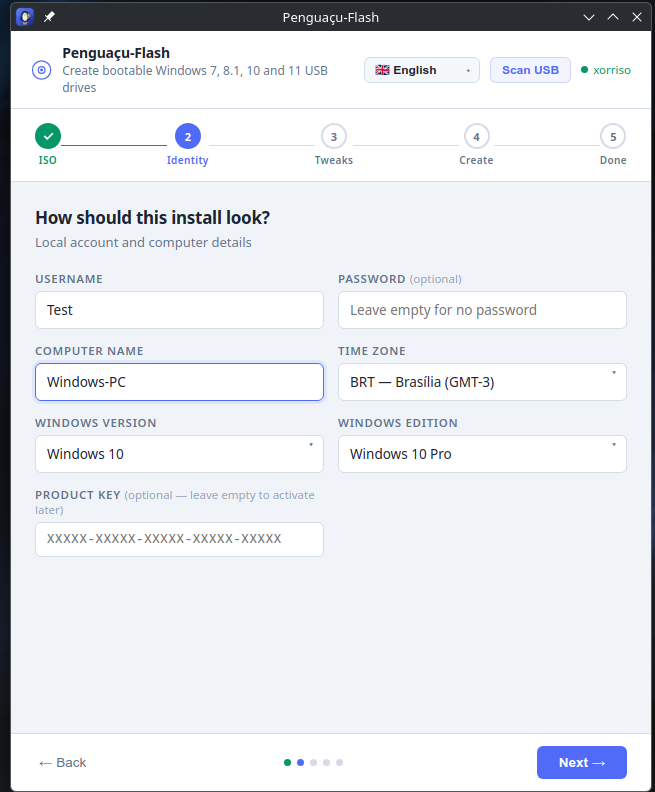
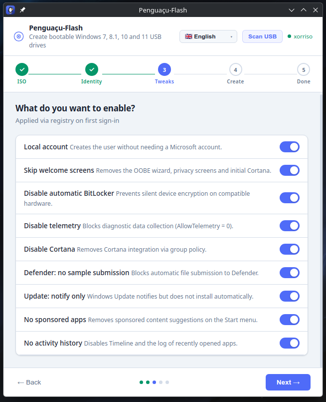
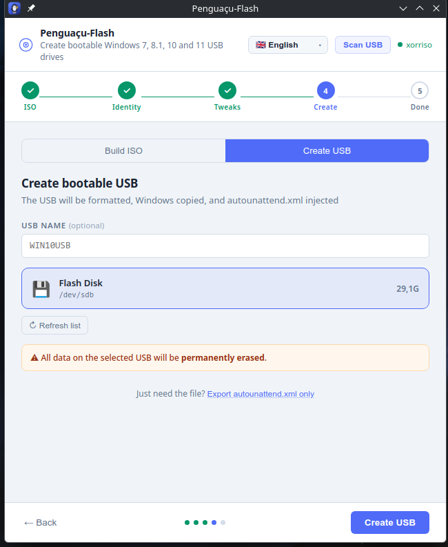

<div align="center">


# Penguaçu-Flash

### 在 Linux 上轻松制作 Windows 7 · 8.1 · 10 · 11 可启动 U 盘

一个完全自包含的 AppImage：格式化 U 盘、复制 Windows，并注入个性化的 `autounattend.xml`——让安装无人值守地运行，账户、语言和隐私设置都已配置好。

**🌍 其他语言:** [English](README.md) · [Português](README.pt-BR.md) · [Español](README.es.md) · **中文** · [हिन्दी](README.hi.md) · [العربية](README.ar.md)

<br/>


</div>

---

## ✨ 为什么选择 Penguaçu-Flash？

在 Linux 上制作 Windows 安装 U 盘通常意味着手动折腾 `parted`、`mkntfs`、`7z` 和引导扇区工具——而且 Windows 还会在安装中途停下来提问。Penguaçu-Flash 在一个窗口里完成全部工作：

- 🐧 **随处可运行** — 单个自包含 AppImage。无需安装依赖：`7-Zip`、`mkntfs` 和 `ms-sys` 均已内置。
- 💾 **真正的可启动 U 盘** — 分区、格式化 NTFS、复制 Windows，并写入 **UEFI 和 BIOS/传统** 引导扇区。
- 🪄 **真正无人值守** — 注入个性化的 `autounattend.xml`，让安装跳过提问，用户名、密码、计算机名、时区和版本都已填好。
- 🧭 **Windows 7 → 11，自动识别** — 从 ISO 文件名识别版本，应答文件会适配每个版本的架构。
- 🛡️ **绕过 Windows 11 限制** — 可选绕过 TPM 2.0、安全启动、内存和 CPU 要求。
- 🔒 **开箱即用的隐私** — 关闭遥测、Cortana、自动 BitLocker、推广应用等。
- 📊 **诚实的进度** — 进度条跟踪*实际写入设备的字节*（含实时 MB/s），而非具有误导性的内存缓存数值。
- 🌐 **支持 6 种语言** — 葡萄牙语、英语、西班牙语、中文、印地语和阿拉伯语（含完整的从右到左布局）。

---

## 📸 截图

<div align="center">

| 选择 ISO | 自动识别版本 |
|:--:|:--:|
|  |  |
| **身份与版本** | **隐私调整** |
|  |  |

**创建可启动 U 盘**



</div>

---

## 🚀 下载与运行

1. 从 [**Releases**](../../releases) 页面获取最新的 **`Penguaçu-Flash-*.AppImage`**。
2. 赋予可执行权限并运行：

```bash
chmod +x Penguaçu-Flash-*.AppImage
./Penguaçu-Flash-*.AppImage
```

就这么简单——无需安装，无需依赖。需要权限的步骤（分区、格式化、写入引导扇区）会通过系统标准授权对话框请求一次密码。

> **提示：** 在 KDE/GNOME 上，你也可以直接在文件管理器中双击该 AppImage。

---

## 🧭 使用方法

| 步骤 | 发生了什么 |
|------|-----------|
| **1. ISO** | 拖入你的 Windows ISO。版本（7/8.1/10/11）会自动识别。 |
| **2. 身份** | 设置用户名、密码、计算机名、时区、版本以及（可选）产品密钥。 |
| **3. 调整** | 选择隐私/行为调整项，以及针对 Windows 11 的要求绕过。 |
| **4. 创建** | 选择 **生成 ISO**（一个新的自定义 `.iso`）或 **创建 U 盘**（格式化 + 复制 + 注入一个可直接启动的 U 盘）。 |
| **5. 完成** | 从 U 盘启动目标机器——Windows 会按你的设置自行安装。 |

你还可以**分析现有 U 盘**、读回其 `autounattend.xml`，并在不重建任何内容的情况下重新注入更新后的配置。

---

## 🛠️ 从源码构建

要求：**Node.js 18+**，构建机上需有 `ntfsprogs`（用于 `mkntfs`）以及 `gcc`/`make`（用于编译内置的 `ms-sys`）。

```bash
git clone https://github.com/vitormoreiradesenvolvedor/penguacu-flash.git
cd penguacu-flash
npm install

# 下载/编译内置二进制文件（7-Zip、mkntfs、ms-sys）到 ./bin
npm run prepare-bins

# 生成 dist/Penguaçu-Flash-<版本>.AppImage
npm run dist
```

开发时实时运行：

```bash
npm start
```

### 项目结构

```
├── main.js              # Electron 主进程 — USB/ISO 逻辑、IPC 处理
├── preload.js           # 通过 contextBridge 暴露给渲染进程的 API
├── index.html           # 整个界面（向导、i18n 词典、样式）
├── scripts/
│   ├── prepare-bins.sh  # 下载/编译内置二进制文件
│   └── afterPack.js     # 包装 Electron 二进制（环境变量 + 噪声过滤）
└── build/
    ├── icon.svg         # 图标源文件
    └── icons/           # 渲染出的 PNG 尺寸
```

---

## 🤝 贡献

非常欢迎贡献——本项目旨在帮助 Linux 社区，人多力量大。🐧

- 🌐 **翻译**：界面词典位于 `index.html`（`I18N` 对象）。新增或改进一种语言是很棒的第一个 PR。
- 🐛 **缺陷与想法**：提交 [issue](../../issues)，附上清晰的复现步骤。
- 🔧 **代码**：fork，从 **`development`** 分支创建分支，并向其发起 pull request。

完整指南见 [CONTRIBUTING.md](CONTRIBUTING.md)。分支模型：

- **`master`** — 稳定的已发布代码。
- **`development`** — 下一次发布前新工作合入的地方。

---

## ⚠️ 免责声明

制作可启动 U 盘会**擦除所选磁盘上的所有数据**。请再三确认选对了设备。应用中显示的产品密钥是微软公开的通用/KMS 安装密钥——它们在安装时用于选择版本，但**不会激活** Windows。请使用有效许可证激活。

---

## 📄 许可证

基于 [MIT 许可证](LICENSE) 发布——可自由使用、修改和分享。

<div align="center">
<br/>
用 🐧 为 Linux 社区而造。
</div>
